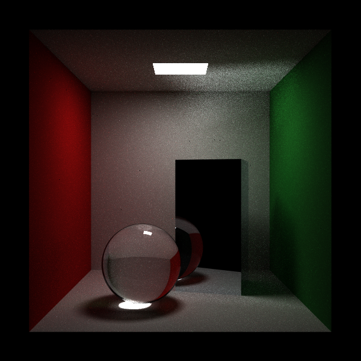
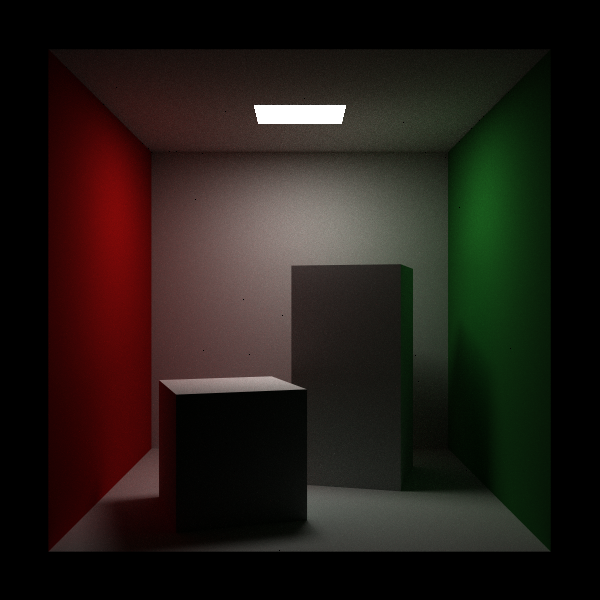
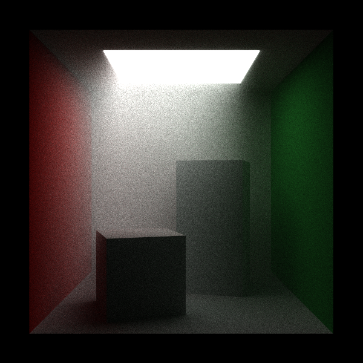

# joetracer
I wrote this program to learn about the basics of raytracing and 3d graphics. It's written in C++, and the only external libraries that it uses are SDL as backend for rendering, and ImGUI for, well, the GUI. 

## Features
- Ray-sphere and axis-aligned rectangle intersections. I also implemented ray-triangle intersections using barycentric coordinates, but I'd like to implement a .obj file parser first before committing.
- Matte and specular reflections.
- Bounding Hierarchy Volume data structure to accelerate large scenes with many non-visible objects.
- Arbitrary rays based on a mix of pdf values and ray generation is supported 
  - For example, this program uses a mix of direct lighting and different reflection models to converge faster

## Screenshots:

Caustics and specular with 2000 samples per pixel.

The Cornell Box rendered at 2000 samples per pixel.

Implementation of fog

Example scene rendered using 1000 samples per pixel. Shows a metallic, glass, and matte material on top of a checkerboard pattern floor.

Example of the GUI of the program.

Resources used:
- https://raytracing.github.io/
- https://graphicscodex.courses.nvidia.com/
- https://lazyfoo.net/tutorials/SDL
- https://www.pbr-book.org/

Requirements for building:
- OpenMP
- SDL (Simple DirectMedia Layer)
- Eigen

This is only tested on Arch Linux, and it is not guaranteed to run on other Unix platforms. I haven't ported the program to Windows yet.
