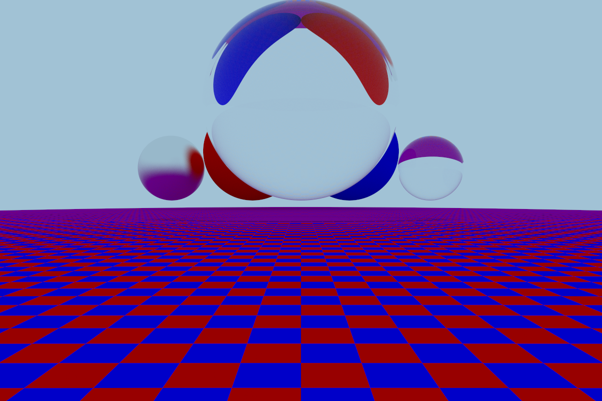
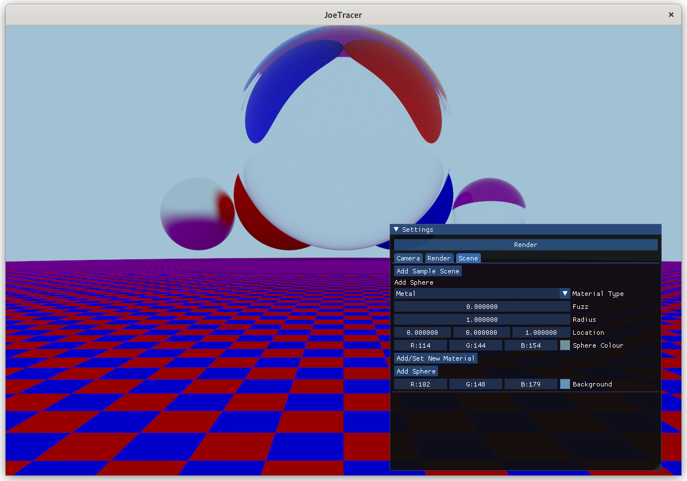

# joetracer
I wrote this to learn about the basics of raytracing and graphics rendering. It's written in C++ (No OpenGL) and uses the Nuklear C GUI library and SDL as backend for rendering.

Screenshots:
Example scene rendered using 1000 samples. Shows a metallic, glass, and matte material on top of a checkerboard pattern floor.

GUI of the program.

Resources used:
https://raytracing.github.io/
https://graphicscodex.courses.nvidia.com/
https://lazyfoo.net/tutorials/SDL
https://www.pbr-book.org/

Requirements for building:
- OpenMP
- SDL (Simple DirectMedia Layer)

Run the makefile included to compile.